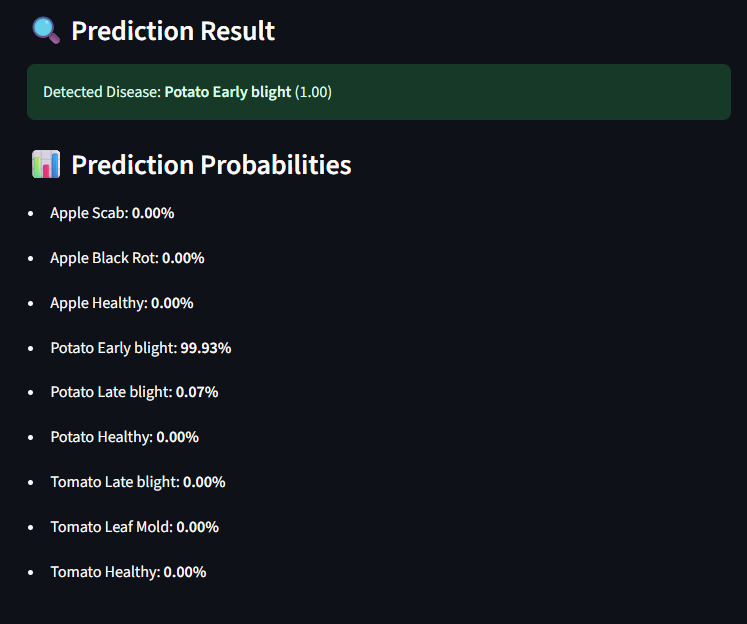
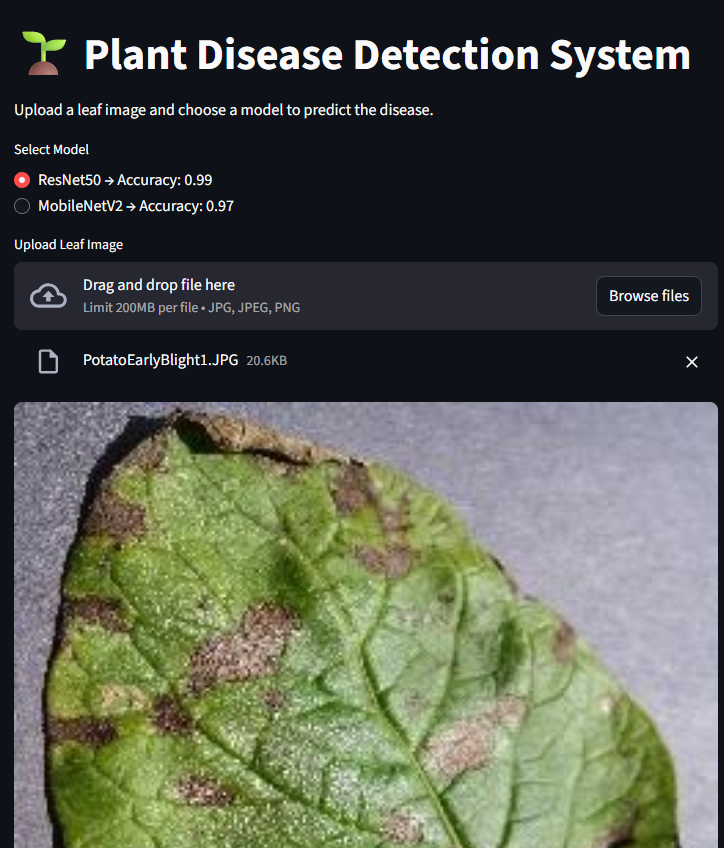
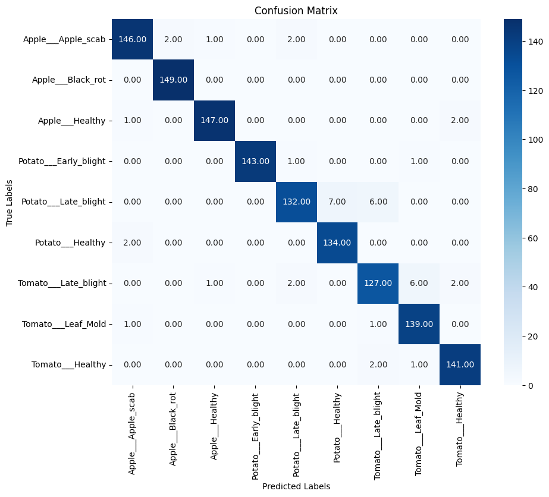

````markdown
# 🌱 Plant Disease Detection System

This project is a **deep learning-based system** for detecting plant diseases from leaf images. It uses **transfer learning** with pre-trained CNN models to classify images of apple, potato, and tomato leaves into **healthy** or **diseased** categories.

---

## 🚀 Features

- Two selectable models: **ResNet50** and **MobileNetV2**
- Upload a leaf image and get real-time disease prediction
- Shows prediction confidence and class probabilities
- Displays overall model test accuracy
- Interactive **Streamlit GUI**

---

## 📂 Dataset

The [New Plant Diseases Dataset](https://www.kaggle.com/datasets/vipoooool/new-plant-diseases-dataset) was used for this project, which contains images of healthy and diseased plant leaves.  
For this project, 9 classes were selected:

- **Apple**: Apple Scab, Black Rot, Healthy
- **Potato**: Early Blight, Late Blight, Healthy
- **Tomato**: Late Blight, Leaf Mold, Healthy

---

## 🧠 Models

### 1. **ResNet50**

- Deep CNN with residual connections
- Accuracy achieved: **99%**

### 2. **MobileNetV2**

- Lightweight CNN optimized for mobile/edge devices
- Accuracy achieved: **97%**

---

## 🛠️ Installation

Clone the repo and install dependencies:

```bash
git clone https://github.com/your-username/plant-disease-detection.git
cd plant-disease-detection
pip install -r requirements.txt
```
````

Run the Streamlit app:

```bash
streamlit run app.py
```

---

## 📊 Results

- **ResNet50** achieved **99% test accuracy**
- **MobileNetV2** achieved **97% test accuracy**

```markdown




```

---

---

```

---


```
